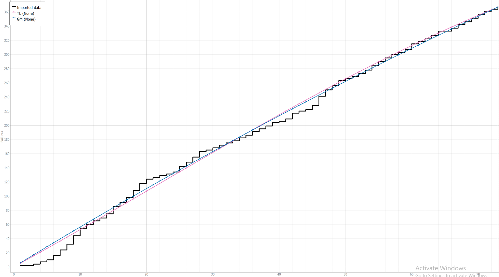
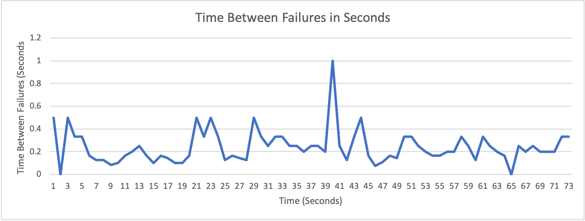
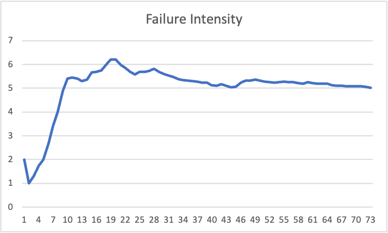
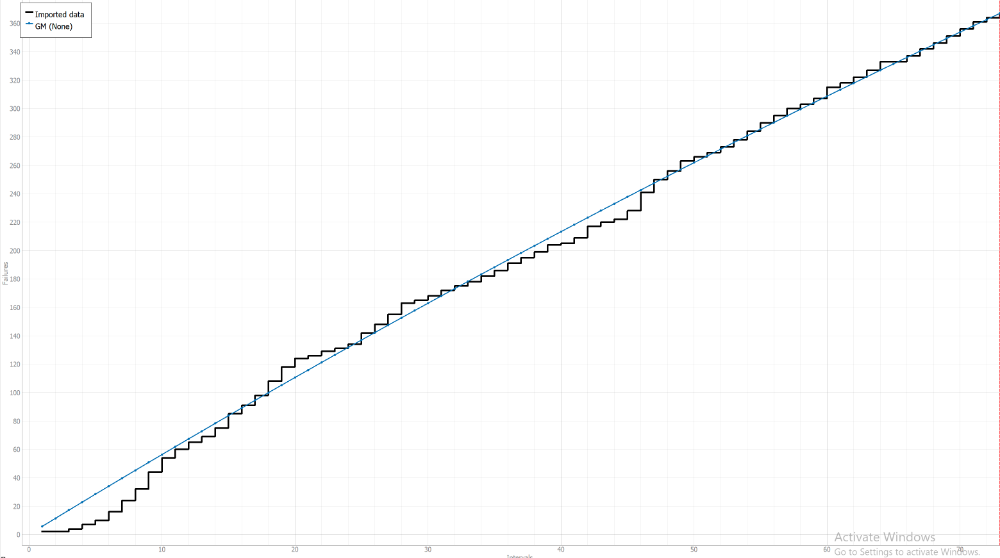
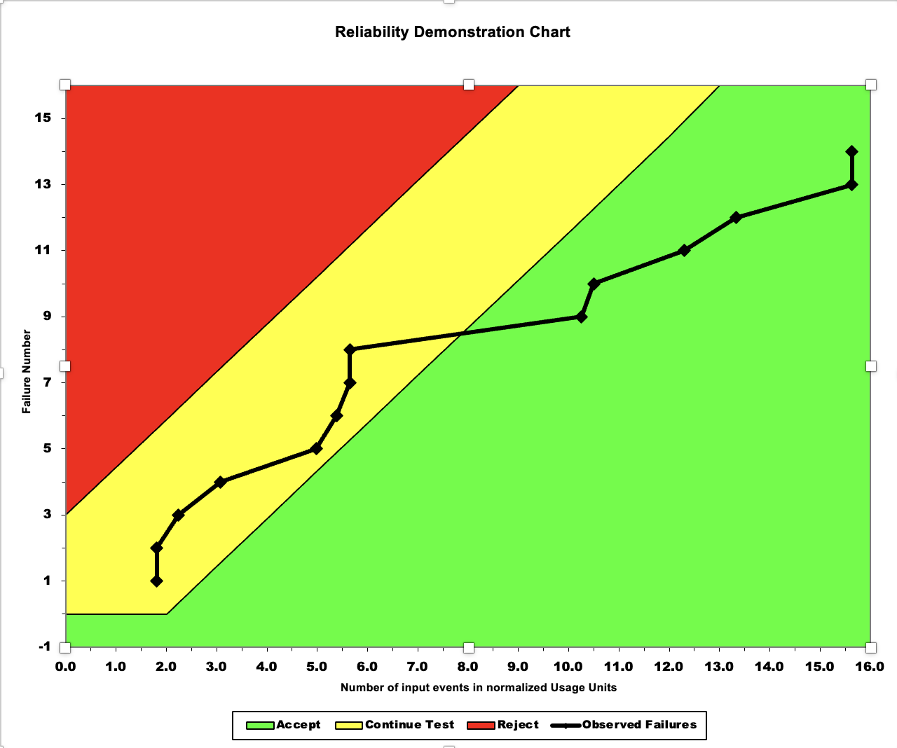
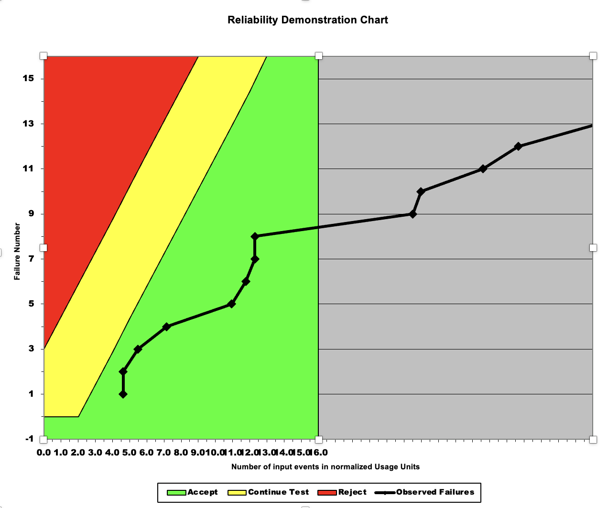
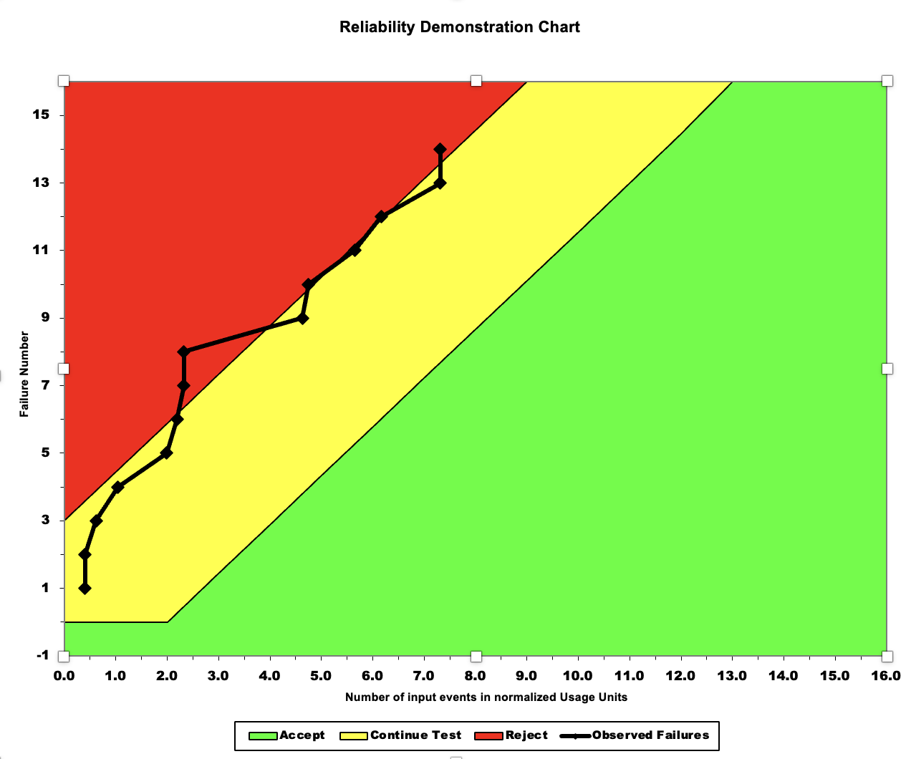

**SENG 438- Software Testing, Reliability, and Quality**

**Lab. Report \#5 – Software Reliability Assessment**

| Group \#:       | 16 |
|-----------------|---|
| Student Names:  |   |
|  Ethan Winters              |   |
|  Carter Marcelo              |     |
|  Jason Pang		|     |
|  Karim Mansour            |     |

# Introduction

This lab features the use of two new software systems to provide test environments and analysis tools for software failure data. Analyzing the various aspects of this data is crucial in order to ensure the errors in the code are fixed and that the sources can be properly identified. Sometimes it can be useful to try multiple tools in the same context to gain a rich understanding of the truth behind the problem. In this lab, the tools to be used are C-SFRAT and RDC-11, both of which will be used independently and then have their results compared towards the end of this report. 

# Assessment Using Reliability Growth Testing 

As seen in this figure above, the TL and GM models provided the lines of best fit for the data in this model. The data set we analyzed here was J5.DAT, and more tests using this data plot are shown in the below figures. 

As shown by the results, due to the failure intensity peaking at around the 16th error, the system's data will be analyzed up to and including error 16, which ensures the removal of the drop after this peak to allow for more consistency in the data in future tests. The failure rate also contributed to how various parts of the data were excluded from later calculations, as the time between failures is somewhat high to start, but begins to rise up again around 19 seconds. This indicated that going past 19 in the inclusiveness of the tests may lead to data inconsistency if some data were not to be cut from the calculations.

While reliability is possible to calculate, unfortunately, due to the calculations for reliability requiring the number of components in the system under test to be known, both the total amount of components and the number that failed. Without these provided, it is not possible to calculate the reliability of the software in this given context, and since they were not provided in the software documentation or failure reports, a reliability graph could not be generated. 

A strong plus of this method of analysis is the strong ability to use various graph data to select the correct data set to analyze the system in more defined detail, making it much easier to determine the true reliability. A drawback however is the requirement of various graph types to fully analyze the data and ensure it is reliable enough and high enough in quality and consistency to test. These combined together allow this method of software failure analysis to be proven useful when dealing with various considerations and factors that could be contributing to the reliability, or lack thereof. 

# Assessment Using Reliability Demonstration Chart 

In the first figure, the MTTF has been set to 41.7, which generated a graph with the best fit for this data set. The adjusted graphs are shown below, with the MTTF first doubled, then halved. These further showcase the reliability graph when the MTTF is heavily shifted, which allowed us to better determine the correct domain to select the value. 

By showcasing how these massive changes in the MTTF cause dramatic graph shifts that often leave the data in the failure zone or far beyond the scope of the graph. To ensure the best fit, these domain boundaries were selected and then further narrowed based on graph behaviour when they were changed. This ultimately lead to the selection of the 41.7 for a best-fit MTTF for this data set, as it allows for the most data points to be in the passing zone while avoiding outstretching the graph. 

This method of software analysis is high beneficial for improving the understanding of the effect various software parameters have on the reliability of the system. This proves is strongly advantaged compared to some other methods, as much less graphed data is actually required to gather the stats required for the reliability analysis. This is however drawn back by the requirement for a user to locate the MTTF of best fit manually, while it would be theoretically possible to have the system calculate it based on calculations and patterns data to predict the best fit line for the data set.

# Comparison of Results

Both methods of software failure analysis have showcased great adequacy in the comparison of software failure data and the display of this data to draw conclusions regarding the software's overall reliability and failure rates. Some of these statistics were better calculated by some methods than others, while some were successful by both, such as the ability to highlight failure rate in both charts. 

# Discussion on Similarity and Differences of the Two Techniques

While one method, being the use of Reliability Growth Testing showed stronger adequacy in calculating statistics such as Failure Intensity and Rate, the Reliability Demonstration Chart method proved itself useful in more efficiently calculation reliability overall. The use of the both of them in unison would prove useful for providing a full analysis of software failures while providing a rich set of data with strong consistency.  

# How the team work/effort was divided and managed

As this lab featured two different parts to be split among 4 students, each student selected one method to focus on (2 for each of the 2 methods) while also allowing themselves to be educated on the other method by working closely with their peers in the group. Group meetings were held online through Discord to allow for a high level of collaboration and communication while ensuring everyone could gain an understanding of both methods while continuing to focus on the one they chose.  

# Difficulties encountered, challenges overcome, and lessons learned

Throughout this lab, the challenges of understanding the new software's operations and principles proved difficult in such as short time frame. To overcome this, our group held research sessions and 'sandbox' sessions where the software was picked apart and analyzed when test runs were also held. Research was done on the side to ensue a deep, proper understanding of the software's demands was met. This effetely allowed us to all understand it together so collaboration on the actual lab analysis could begin. 

# Comments/feedback on the lab itself

This lab document proved easy to follow in terms of steps and setup, though we feel it would be wise to include higher quality documentation on the software under test as well as the testing software in the future to allow for a high rate of work while improving efficiency as we would no longer need to spend time researching the software to understand its workings 